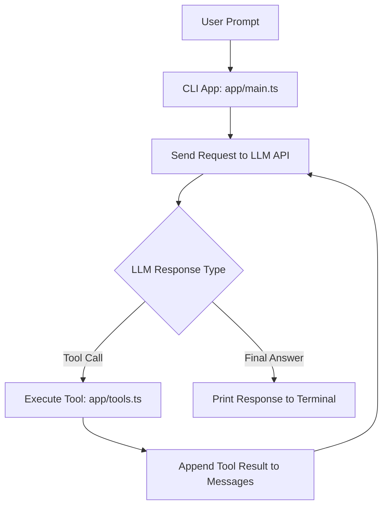

# Build Your Own Claude Code (CodeCrafters)

This project is a simple TypeScript implementation of the
**"Build Your Own Claude Code"** challenge from
[CodeCrafters](https://codecrafters.io/challenges/claude-code).

The goal is to build a CLI coding assistant that:
- accepts a user prompt,
- calls an LLM,
- executes tools,
- and loops until a final response is ready.

## Flow Diagram



## Run

```sh
./your_program.sh
```

## Submit to CodeCrafters

```sh
codecrafters submit
```
